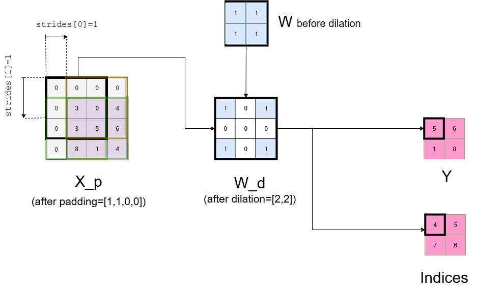

# Contents

- **MaxPool** operator for type [real](#real)
- **MaxPool** operator for types [float16, float, double](#float)

Based on ONNX documentation [MaxPool version 22](https://onnx.ai/onnx/operators/onnx__MaxPool.html).

<a id="real"></a>
# **MaxPool** (real)

## Signature
$(Y, \textit{Indices}) = \textbf{MaxPool}(X)$

where:
- $X$: Input tensor
- $Y$: Output tensor containing max value selected from $X$
- $\textit{Indices}$: Output tensor containing the indices in $X$ from where the max values are taken.

<a id="restrictions"></a> 
## Restrictions

[General restrictions](../common/general_restrictions.md) are applicable.

The following specific restrictions apply to the **MaxPool** operator:

| Restriction | Statement                                                   | Origin                                                                                      |
|-------------|-------------------------------------------------------------|---------------------------------------------------------------------------------------------|
| `[R1]` <a id="R1"></a> | Input tensor $X$ has 2 spatial axes | Transient |
| `[R2]` <a id="R2"></a> | All attributes must be explicitly set  | [No default values](../../../../../deliverables/reqs/reqs.md#no_default_value)
| `[R3]` <a id="R3"></a> | Attribute `auto_pad` is restricted to NOTSET  | Transient
| `[R4]` <a id="R4"></a> | Attribute `ceil_mode` is set to zero  | Transient
| `[R5]` <a id="R5"></a> | Attribute `storage_order` is set to zero | Transient

<a id="Informal_spec"></a>
## Informal specification

Operator **MaxPool** consumes an input tensor $X$ and applies max pooling across the tensor according to the $\text {kernel\_shape}$, $\text{strides}$, $\text{dilations}$ and $\text{pads}$. Max pooling consists of computing the max on all values of a subset of the input tensor according to the kernel shape and downsampling the data into the output tensor $Y$.

**MaxPool** is a sliding window operator like **Conv**, for instance. In contrast to **Conv**, the sliding window, called "kernel", or $W$. At a given position, the kernel is only there for indicating the set of elements of $X$ of which the maximum shall be computed. Therefore, only the shape of the kernel matters for **MaxPool**.

Operator **MaxPool** stores in $Indices$ the indices of the input tensor $X$ from which the max values are taken. The index values are those of a flatten 1-D view of $X$.

The mathematical definition of output $Y$ and $Indices$ are given hereafter:

$$\begin{gathered}
    Y[b, c, m, n] = \text{max}_{h=0}^{dW_0-1} \text{max}_{w=0}^{dW_1-1} \\ X_p[b,c,m \cdot \text{strides}[0]+ h \cdot \text{dilations}[0], n \cdot \text{strides}[1]+ w \cdot \text{dilations}[1] ]
\end{gathered}$$

$$\begin{gathered}
   Indices[b, c, m, n] = (h \cdot dX_3 + w) ~~\text{if}~~ Y[b, c, m, n] = X[h,w] 
\end{gathered}$$


Where
- $h \in [0,dX_2-1]$ is the index on the first spatial axis of $X_p$, whose dimension is $dX_2$.
- $w \in [0,dX_3-1]$ is the index on the second spatial axis of $X_p$, whose dimension is $dX_3$.
- $b \in [0,dY_0-1]$ is the batch index. $dY_0$ is the batch size of output $Y$
- $c \in [0,dY_1-1]$ is the data channel. $dY_1$ is the number of data channels of output $Y$
- $m \in [0,dY_2-1]$ is the index along the first spatial axis of output $Y$
- $n \in [0,dY_3-1]$ is the index along the second spatial axis of output $Y$
- $dW_0$ is the dimension of the first spatial axis of the kernel, i.e., the first value of attribute $\text{kernel\_shape}$
- $dW_1$ is the dimension of the second spatial axis of the kernel, i.e., the second value of attribute $\text{kernel\_shape}$
- $\text{strides}$ is an attribute of the operator. It will be described later in this section.
- $\text{dilations}$ is an attribute of the operator. It will be described later in this section.
- $X_{p} = \text{pad}(X,pads)$ is the padded version of the input tensor $X$. Function $\text{pad}$ applies padding as specified by attribute [pads](#real_pads).

### A graphical view of MaxPool:



### Example

$\text{Y},\text{indices} = \text{MaxPool}(X)$

- Shape of $X$ = [1, 1, 8, 8]
- $\text{kernel\_shape} = [3,3]$
- $\text{pads} = [0,0,0,0]$
- $\text{dilations} = [1,1]$
- $\text{strides} = [1,1]$
- Shape of $Y$ = [1, 1, 6, 6]
- Shape of $\text{indices}$ = [1, 1, 6, 6]


```math
X =
\begin{bmatrix}
  \begin{bmatrix}
    \begin{bmatrix}
        5.67591154 & -0.04859958 & 2.94203104 & 3.70327292 & 2.47014306 & 4.12455586 & 5.81838665 & 1.84118807 \\
        -0.05267874 & 2.75227858 & 2.16608732 & 4.03416243 & 1.28184638 & 4 81748948 & 4.64878412 & 3.31626988 \\
        3.55427648 & 0.39997585 & 4.45761508 & 4.82722666 & 0.18843372 & 0.49564314 & 7.96647029 & 4.82851447 \\
        1.52417623 & 2.28965587 & 0.36251913 & 1.64413983 & 4.67267459 & 3.73167179 & 2.20052118 & 2.06720836 \\
        -1.22446366 & -0.86469519 & 6.01461967 & -1.08813165 & 2.11920055 & 0.78561867 & 0.29834533 & 1.94499626 \\
        1.57776732 & 3.64260188 & 3.47181319 & 4.83723727 & 1.49868674 & 3.27683692 & 2.42625178 & 0.4401565 \\
        6.8972704 & 5.51113868 & 5.99293336 & 4.24088721 & 1.94993561 & -0.04040625 & 3.07940675 & 3.06769141 \\
        3.1299626 & 4.5546675 & 3.5008191 & 2.06181403 & 3.27400104 & 6.70386189 & 0.92777015 & -1.29092574
    \end {bmatrix}
  \end {bmatrix}
\end {bmatrix}
```

```math
Y =
\begin{bmatrix}
  \begin{bmatrix}
    \begin{bmatrix}
        5.67591154 & 4.82722666 & 4.82722666 & 4.82722666 & 7.96647029 & 7.96647029 \\
        4.45761508 & 4.82722666 & 4.82722666 & 4.82722666 & 7.96647029 & 7.96647029 \\
        6.01461967 & 6.01461967 & 6.01461967 & 4.82722666 & 7.96647029 & 7.96647029 \\
        6.01461967 & 6.01461967 & 6.01461967 & 4.83723727 & 4.67267459 & 3.73167179 \\
        6.8972704 & 6.01461967 & 6.01461967 & 4.83723727 & 3.27683692 & 3.27683692 \\
        6.8972704 & 5.99293336 & 5.99293336 & 6.70386189 & 6.70386189 & 6.70386189
    \end {bmatrix}
  \end {bmatrix}
\end {bmatrix}
```

```math
Indices = 
\begin{bmatrix}
  \begin{bmatrix}
    \begin{bmatrix}
        0 & 19 & 19 & 19 & 22 & 22 \\
        18 & 19 & 19 & 19 & 22 & 22 \\
        34 & 34 & 34 & 19 & 22 & 22 \\
        34 & 34 & 34 & 43 & 28 & 29 \\
        48 & 34 & 34 & 43 & 45 & 45 \\
        48 & 50 & 50 & 61 & 61 & 61
    \end {bmatrix}
  \end {bmatrix}
\end {bmatrix}
```


## Error conditions
No error conditions.

<a id="real_attributes"></a>
## Attributes

### $\text{auto\_pad}$: `string`

The $\text{auto\_pad}$ attribute determines if and how automatic padding is done for the input tensor $X$.

#### Constraints
-  `[C1]`: Value domain 
    - Statement: $\text{auto\_pad}$ shall be in set {NOTSET, VALID, SAME_UPPER, SAME_LOWER}. 
    - Rationale: `[R2]`
-  `[C2]`: Explicit padding 
    - Statement: $\text{auto\_pad}$ shall be set to NOTSET. 
    - Rationale: `[R3]`

### $\text{ceil\_mode}$: `int`

Whether to use floor (0, default) or ceil (1) to compute the output shape. See the description of output $Y$.

#### Constraints
-  `[C1]`: Value domain 
    - Statement: $\text{ceil\_mode}$ shall be in set, i.e., to 0 (zero) or 1.
    - Rationale: `[R2]`
-  `[C2]`: floor mode is selected 
    - Statement: $\text{ceil\_mode}$ shall be set to 0.
    - Rationale: `[R4]`

### $\text{dilations}$: `list of ints`

Dilation value along each spatial axis of filter.

Attribute $\text{dilations}$ specifies the spacing between the elements of $W$. The ith value in the list gives the dilation factor for spatial axis $i$. If the dilation factor is greater than 1 for axis $i$, then the kernel elements are spaced out by the dilation factor for that axis. 

The effect of the $\text{dilations}$ attribute for a tensor with two spatial axes is depicted on the following figure.  


In the example above:
- $\text{dilations}$=(2,2)
- Before dilation, $W$ contains only 1s. Those 1s are used as selectors of values of $X$.
- After dilation, a '0' means that the value in $X$ is not selected.
- The offset between two '1' in the dilated $W$ along one spacial axis equals the dilation value for that axis, i.e., '2' in the example. Therefore, at a given position of $W$ on $X$, one value of $X$ over two is selected for computing the max along each spatial axis. 
  
#### Constraints
- `[C1]`: Value domain
    - Statement: $\text{dilations}$ is a list of strictly positive integers
    - Rationale: The dilation is a *factor of expansion* along a certain axis. 
- `[C2]`: Relation between $\text{dilations}$ and $W$ 
    - Statement: The $\text{dilations}$ and $\text{kernel\_shape}$ lists have the same length
    - Rationale: Dilation is defined for all spatial axes of $W$.
- `[C3]`: Consistency between the shape of tensors $Y$, $X$ and attributes $\text{kernel\_shape}$, $\text{pads}$, $\text{dilations}$ and $\text{strides}$  
    - Statement: See constraint [<b><span style="font-family: 'Courier New', monospace">[C1]</span></b>](#shape_consist) on tensor $Y$.


### $\text{kernel\_shape}$: `list of ints`

The size of the kernel along each spatial axis.

<a id="real_pads"></a>
### $\text{pads}$: `list of ints`

Attribute $\text{pads}$ determines the padding at the beginning and end along each spatial axis of the input tensor $X$.

$\text{pads}$ is a list of the form (`x1_begin`, `x2_begin`,..., `x1_end`, `x2_end`,...), where `xi_begin` is the number of elements (possibly zero) added at the beginning of axis $i$ and `xi_end` is the number of elements added at the end of axis $i$.

The value of the constant to pad depends on the input tensor data type. Therefore:
- see [floating-point value to pad](#pad_const_float_val)


#### Constraints
- `[C1]`: Consistency between the shape of $X$ and the length of $\text{pads}$
    - Statement: The length of the $\text{pads}$ list is twice the number of spatial axes of $X$
    - Rationale: Padding shall be given for all spatial axes, and a begining value and an end value must be given for each axis.
- `[C2]`: Consistency between the shape of tensors $Y$, $X$ and attributes $\text{kernel\_shape}$, $\text{pads}$, $\text{dilations}$ and $\text{strides}$  
    - Statement: See constraint [<b><span style="font-family: 'Courier New', monospace">[C1]</span></b>](#shape_consist) on tensor $Y$.

### $\text{storage\_order}$: `int`

The storage order of the tensor. 0 is row major, and 1 is column major.

#### Constraints
-  `[C1]`: Explicit storage order
    - Statement: $\text{storage\_order}$ shall be set to zero.
    - Rationale: `[R2]`, `[R5]`

### $\text{strides}$: `list of ints`

Attribute $\text{strides}$ determines how the kernel is applied on tensor $X$ during the **MaxPool**.

For instance, with $\text{strides}[0]=3$ and $\text{strides}[1]=2$, the kernel is applied to data 3 units down in the first spatial axis and to data 2 units on right in the second spatial axis at each step of the convolution.
The effect of the $\text{strides}$ attribute is illustrated on the following figure. In this example, $\text{strides}$=(3,2).


#### Constraints
- `[C1]`: Value domain
    - Statement: $\text{strides}$ is a list of strictly positive integers.
    - Rationale: Stride values represent the number of applications of the kernel in the two spatial dimensions
- `[C2]`: Consistency between the shape of tensors $Y$, $X$ and  attributes $\text{kernel\_shape}$, $\text{pads}$, $\text{dilations}$ and $\text{strides}$
    - Statement: See constraint [<b><span style="font-family: 'Courier New', monospace">[C1]</span></b>](#shape_consist) on tensor $Y$.


## Inputs

### $\text{X}$: `tensor real`

Tensor $X$ is the input tensor from which the max values are selected.

The shape of tensor $X$ is $(dX_0 , dX_1 , dX_2 , dX_3)$

Where
- $dX_0$ is the batch size of input $X$.
- $dX_1$ is the number of data channels of input $X$.
- $dX_2$ and $dX_3$ are the sizes of the input for the two spatial axes (height and width).


#### Constraints

- `[C1]` <a id="C1ia"></a> Number of spatial axes of tensor $X$
    - Statement: The number of spatial axes of tensor $X$ is 2. 
    - Rationale: `R1`.
- `[C2]`: Consistency between the shape of tensors $Y$, $X$ and  attributes $\text {kernel\_shape}, \text {pads}, \text {dilations}$ and $\text {strides}$
    - Statement: See constraint [<b><span style="font-family: 'Courier New', monospace">[C1]</span></b>](#shape_consist) on tensor $Y$.

- `[C4]` Axis denotations 
    - Statement: If axis denotation is in effect, the operation expects input data tensor to have axis denotation \[`DATA_BATCH`, `DATA_CHANNEL`, `DATA_FEATURE`, `DATA_FEATURE`\].
    - Rationale: Denotation convention


## Outputs

### $\text{Y}$: `tensor real`

The shape of the output $Y$ is $(dY_0 , dY_1 , dY_2 , dY_3)$ where
- $dY_0$ is the number of batches
- $dY_1$ is the number of channels
- $dY_2$ and $dY_3$ are the sizes of the output for the two spatial axes

#### Constraints.
- `[C1]`: <a id="shape_consist"></a> Consistency between the shape of tensors $Y$, $X$, and attributes $\text{kernel\_shape}, \text{pads}, \text{dilations}$ and $\text{strides}$
    - Statement:
        - $dY_2 = \left\lfloor{(dX_2 + pad\_shape[0] - \texttt{dilations}[0] \times (\texttt{kernel\_shape}[0] - 1) - 1) / (strides[0] + 1)}\right\rfloor$
        - $dY_3 = \left\lfloor{(dX_3 + pad\_shape[1] - \texttt{dilations}[1] \times (\texttt{kernel\_shape}[1] - 1) - 1) / (strides[1] + 1)} \right\rfloor$
        - where $pad\_shape[i]$ is the sum of the pads along spatial axis $i$ 
        - In the previous formula, `ceil_mode` is considered set to 0.
 

### $\text{Indices}$: `integer`

$Indices$ contains the indices of the input tensor $X$ from which the max values are taken.

#### Constraints

 - `[C1]` <a id="C1iy"></a> First constraint on $Indices$
   - Statement: $Indices$ and $Y$ shall have the same shape